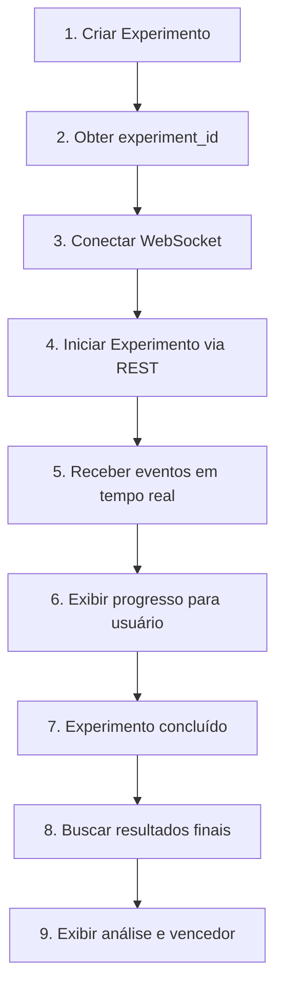

# 🚀 InfinitePay A/B Test API - Frontend Integration Guide

## 📋 Sumário

- [Visão Geral](#visão-geral)
- [Autenticação](#autenticação)
- [Endpoints REST](#endpoints-rest)
- [WebSocket - Streaming em Tempo Real](#websocket---streaming-em-tempo-real)
- [Fluxo Completo de Uso](#fluxo-completo-de-uso)
- [Estruturas de Dados](#estruturas-de-dados)
- [Exemplo de Implementação](#exemplo-de-implementação)

---

## 🎯 Visão Geral

### Base URL

```
http://localhost:8000
```

### Headers Padrão

```javascript
{
  "Content-Type": "application/json",
  "X-API-Key": "sua-chave-api-aqui"
}
```

---

## 🔐 Autenticação

### Configuração da Chave API

Todos os endpoints da API requerem autenticação por chave API.

**Desenvolvimento:**

```javascript
const API_KEY = 'sk-infinitepay-test-key-do-not-use-in-production';
```

**Produção:**

```javascript
const API_KEY = process.env.INFINITEPAY_API_KEY;
```

### Headers HTTP

Adicione o header `X-API-Key` em todas as requisições:

```javascript
fetch('http://localhost:8000/experiments', {
  headers: {
    'Content-Type': 'application/json',
    'X-API-Key': API_KEY
  },
  // ...
});
```

### Autenticação WebSocket

Para WebSocket, envie a chave API como primeira mensagem após conectar:

```javascript
const ws = new WebSocket('ws://localhost:8000/ws/experiments/123');

ws.onopen = () => {
  // IMPORTANTE: Primeira mensagem deve ser a chave API
  ws.send(API_KEY);
};

ws.onmessage = (event) => {
  const data = JSON.parse(event.data);

  // Verificar erros de autenticação
  if (data.event === 'auth_error') {
    console.error('Falha na autenticação:', data.detail);
    return;
  }

  // Processar outras mensagens
  handleMessage(data);
};
```

---

## 📡 Endpoints REST

### 1️⃣ **Health Check**

```http
GET /health
```

**Response:**

```json
{
  "status": "healthy",
  "timestamp": "2025-08-22T09:33:00.000Z"
}
```

---

### 2️⃣ **Criar Experimento**

```http
POST /experiments
X-API-Key: sua-chave-api
```

**Request Body:**

```json
{
  "name": "Teste de Mensagens Q4 2025",
  "description": "Comparação de CTAs para campanha de fim de ano",
  "control": {
    "hook": "Simplifique pagamentos 💳",
    "body": "Controle total dos gastos empresariais.",
    "cta": "Começar"
  },
  "variant_a": {
    "hook": "Cashback garantido 💰",
    "body": "2% de volta em todas as compras.",
    "cta": "Ativar"
  },
  "variant_b": {
    "hook": "Gestão inteligente 📊",
    "body": "Relatórios automáticos e limites personalizados.",
    "cta": "Testar"
  },
  "sample_size": 5,
  "context": "Você é um empresário avaliando soluções de pagamento."
}
```

**Response:**

```json
{
  "id": "48edc9c3-6d97-4760-8917-f4641e7ccc3f",
  "name": "Teste de Mensagens Q4 2025",
  "status": "created",
  "created_at": "2025-08-22T09:33:00.000Z"
}
```

---

### 3️⃣ **Listar Experimentos**

```http
GET /experiments
X-API-Key: sua-chave-api
```

**Response:**

```json
{
  "experiments": [
    {
      "id": "48edc9c3-6d97-4760-8917-f4641e7ccc3f",
      "name": "Teste de Mensagens Q4 2025",
      "status": "completed",
      "created_at": "2025-08-22T09:33:00.000Z",
      "completed_at": "2025-08-22T09:35:00.000Z"
    }
  ]
}
```

---

### 4️⃣ **Buscar Experimento Específico**

```http
GET /experiments/{experiment_id}
X-API-Key: sua-chave-api
```

**Response:**

```json
{
  "id": "48edc9c3-6d97-4760-8917-f4641e7ccc3f",
  "name": "Teste de Mensagens Q4 2025",
  "description": "Comparação de CTAs para campanha de fim de ano",
  "status": "completed",
  "config": {
    "control": {...},
    "variant_a": {...},
    "variant_b": {...}
  },
  "created_at": "2025-08-22T09:33:00.000Z"
}
```

---

### 5️⃣ **Iniciar Execução do Experimento**

```http
POST /experiments/{experiment_id}/run
X-API-Key: sua-chave-api
```

**Response:**

```json
{
  "message": "Experiment started",
  "experiment_id": "48edc9c3-6d97-4760-8917-f4641e7ccc3f",
  "status": "running"
}
```

⚠️ **IMPORTANTE:** Após iniciar, conecte-se ao WebSocket para receber atualizações em tempo real!

---

### 6️⃣ **Buscar Resultados**

```http
GET /experiments/{experiment_id}/results
X-API-Key: sua-chave-api
```

**Response:**

```json
{
  "control": {
    "scores": [5, 6, 7, 5, 6],
    "mean": 5.8,
    "std_dev": 0.84,
    "confidence_interval": [5.2, 6.4]
  },
  "variant_a": {
    "scores": [7, 8, 7, 6, 8],
    "mean": 7.2,
    "std_dev": 0.84,
    "confidence_interval": [6.6, 7.8]
  },
  "variant_b": {
    "scores": [6, 5, 6, 7, 6],
    "mean": 6.0,
    "std_dev": 0.71,
    "confidence_interval": [5.5, 6.5]
  },
  "winner": "variant_a",
  "statistical_significance": 0.92
}
```

---

### 7️⃣ **Buscar Pensamentos dos Agentes**

```http
GET /experiments/{experiment_id}/thoughts
X-API-Key: sua-chave-api
```

**Response:**

```json
[
  {
    "agent_name": "Mariana Ferreira Alves",
    "variant": "control",
    "timestamp": "2025-08-22T09:33:10.000Z",
    "score": 5,
    "intent": "talvez",
    "concerns": "falta de clareza sobre benefícios concretos",
    "positive_aspects": "promessa de controle total",
    "user_message": "Você está avaliando uma notificação...",
    "think": "Primeiro, devo avaliar a eficácia da mensagem...",
    "talk": "A efetividade da mensagem é mediana, daria um 6..."
  }
]
```

---

## 🔌 WebSocket - Streaming em Tempo Real

### Conectar ao WebSocket

```javascript
const ws = new WebSocket('ws://localhost:8000/ws/experiments/{experiment_id}');

// IMPORTANTE: Enviar API key como primeira mensagem
ws.onopen = () => {
  ws.send('sua-chave-api');
};
```

### Eventos Recebidos

#### 1. **Conexão Estabelecida**

```json
{
  "event": "connected",
  "data": {
    "experiment_id": "48edc9c3-6d97-4760-8917-f4641e7ccc3f"
  },
  "timestamp": "2025-08-22T09:33:00.000Z"
}
```

#### 2. **Experimento Iniciado**

```json
{
  "event": "experiment.started",
  "data": {
    "experiment_id": "48edc9c3-6d97-4760-8917-f4641e7ccc3f",
    "total_agents": 5,
    "variants": ["control", "variant_a", "variant_b"]
  },
  "timestamp": "2025-08-22T09:33:01.000Z"
}
```

#### 3. **Agente Pensando**

```json
{
  "event": "agent.thinking",
  "data": {
    "agent_name": "Mariana Ferreira Alves",
    "variant": "control"
  },
  "timestamp": "2025-08-22T09:33:05.000Z"
}
```

#### 4. **Agente Digitando (Animação)**

```json
{
  "event": "agent.typing",
  "data": {
    "agent_name": "Mariana Ferreira Alves",
    "partial_text": "A efetividade da mensagem é"
  },
  "timestamp": "2025-08-22T09:33:06.000Z"
}
```

#### 5. **Resposta Completa do Agente**

```json
{
  "event": "agent.responded",
  "data": {
    "agent_name": "Mariana Ferreira Alves",
    "variant": "control",
    "score": 5,
    "response_text": "Score: 5\nIntent: talvez\nConcerns: falta de clareza\nPositive: controle total",
    "analysis": {
      "intent": "talvez",
      "concerns": "falta de clareza e especificidade",
      "positive_aspects": "promessa de controle total"
    },
    "agent_thoughts": {
      "user_message": "Você está avaliando uma notificação...",
      "think": "Primeiro, devo avaliar a eficácia da mensagem recebida da InfinitePay...",
      "talk": "A efetividade da mensagem é mediana, daria um 6..."
    }
  },
  "timestamp": "2025-08-22T09:33:08.000Z"
}
```

#### 6. **Variante Completa**

```json
{
  "event": "variant.completed",
  "data": {
    "variant": "control",
    "results": [
      {"agent": "Mariana Ferreira Alves", "score": 5},
      {"agent": "Carlos Eduardo Pereira", "score": 6}
    ]
  },
  "timestamp": "2025-08-22T09:33:20.000Z"
}
```

#### 7. **Experimento Concluído**

```json
{
  "event": "experiment.completed",
  "data": {
    "experiment_id": "48edc9c3-6d97-4760-8917-f4641e7ccc3f"
  },
  "timestamp": "2025-08-22T09:35:00.000Z"
}
```

---

## 🔄 Fluxo Completo de Uso



---

## 📊 Estruturas de Dados

### AgentThought

```typescript
interface AgentThought {
  agent_name: string;
  variant: "control" | "variant_a" | "variant_b";
  timestamp: string;
  score: number;
  intent: "sim" | "não" | "talvez";
  concerns: string;
  positive_aspects: string;
  user_message: string;  // Mensagem original do USER
  think: string;          // Pensamento interno do agente
  talk: string;           // Resposta falada do agente
}
```

### ExperimentResults

```typescript
interface VariantResult {
  scores: number[];
  mean: number;
  std_dev: number;
  confidence_interval: [number, number];
}

interface ExperimentResults {
  control: VariantResult;
  variant_a: VariantResult;
  variant_b: VariantResult;
  winner: string;
  statistical_significance: number;
}
```

---

## 💻 Exemplo de Implementação

### React + TypeScript

```typescript
import { useState, useEffect } from 'react';

const ABTestRunner = () => {
  const API_KEY = 'sk-infinitepay-test-key-do-not-use-in-production'; // Usar variável de ambiente em produção
  const [experimentId, setExperimentId] = useState<string>('');
  const [status, setStatus] = useState<string>('idle');
  const [agents, setAgents] = useState<Map<string, any>>(new Map());
  const [results, setResults] = useState<any>(null);
  const [ws, setWs] = useState<WebSocket | null>(null);

  // 1. Criar experimento
  const createExperiment = async () => {
    const response = await fetch('http://localhost:8000/experiments', {
      method: 'POST',
      headers: {
        'Content-Type': 'application/json',
        'X-API-Key': API_KEY
      },
      body: JSON.stringify({
        name: 'Teste Frontend',
        description: 'Teste via React',
        control: {
          hook: 'Simplifique pagamentos 💳',
          body: 'Controle total dos gastos empresariais.',
          cta: 'Começar'
        },
        variant_a: {
          hook: 'Cashback garantido 💰',
          body: '2% de volta em todas as compras.',
          cta: 'Ativar'
        },
        variant_b: {
          hook: 'Gestão inteligente 📊',
          body: 'Relatórios automáticos.',
          cta: 'Testar'
        },
        sample_size: 3,
        context: 'Você é um empresário.'
      })
    });

    const data = await response.json();
    setExperimentId(data.id);
    return data.id;
  };

  // 2. Conectar WebSocket
  const connectWebSocket = (expId: string) => {
    const websocket = new WebSocket(
      `ws://localhost:8000/ws/experiments/${expId}`
    );

    websocket.onopen = () => {
      // Autenticar conexão WebSocket
      websocket.send(API_KEY);
    };

    websocket.onmessage = (event) => {
      const data = JSON.parse(event.data);
      console.log('WebSocket event:', data);

      switch (data.event) {
        case 'experiment.started':
          setStatus('running');
          break;

        case 'agent.thinking':
          setAgents(prev => {
            const updated = new Map(prev);
            updated.set(data.data.agent_name, {
              ...updated.get(data.data.agent_name),
              status: 'thinking',
              variant: data.data.variant
            });
            return updated;
          });
          break;

        case 'agent.responded':
          setAgents(prev => {
            const updated = new Map(prev);
            updated.set(data.data.agent_name, {
              status: 'completed',
              variant: data.data.variant,
              score: data.data.score,
              analysis: data.data.analysis,
              thoughts: data.data.agent_thoughts
            });
            return updated;
          });
          break;

        case 'experiment.completed':
          setStatus('completed');
          fetchResults(expId);
          break;
      }
    };

    setWs(websocket);
  };

  // 3. Iniciar experimento
  const startExperiment = async (expId: string) => {
    await fetch(`http://localhost:8000/experiments/${expId}/run`, {
      method: 'POST',
      headers: {
        'X-API-Key': API_KEY
      }
    });
  };

  // 4. Buscar resultados
  const fetchResults = async (expId: string) => {
    const response = await fetch(
      `http://localhost:8000/experiments/${expId}/results`,
      {
        headers: {
          'X-API-Key': API_KEY
        }
      }
    );
    const data = await response.json();
    setResults(data);
  };

  // 5. Fluxo completo
  const runTest = async () => {
    const expId = await createExperiment();
    connectWebSocket(expId);
    await new Promise(resolve => setTimeout(resolve, 1000));
    await startExperiment(expId);
  };

```

---

## 🎨 Features Especiais

### 1. **Animação de Digitação**

O evento `agent.typing` envia o texto caractere por caractere, permitindo criar animação de digitação no frontend.

### 2. **Pensamentos Detalhados**

Cada resposta inclui:

- `user_message`: O que foi enviado ao agente
- `think`: O que o agente pensou internamente
- `talk`: O que o agente respondeu

### 3. **Análise Estruturada**

Cada agente retorna:

- `intent`: sim/não/talvez
- `concerns`: Principais objeções
- `positive_aspects`: Pontos positivos identificados
- `score`: Nota de 1-10

---

## 🔐 Considerações de Produção

1. **CORS**: Configure CORS no backend para permitir conexões do frontend
2. **Autenticação**: Adicione tokens JWT para proteger endpoints
3. **Rate Limiting**: Implemente limites de requisições
4. **Error Handling**: Trate reconexões de WebSocket
5. **Timeout**: Configure timeouts para experimentos longos
